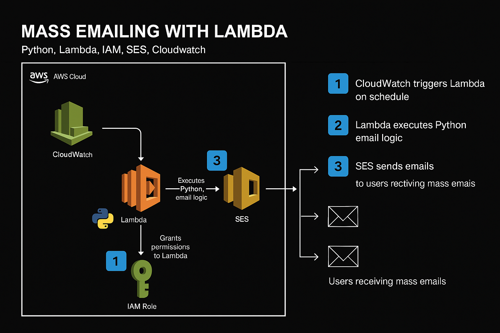
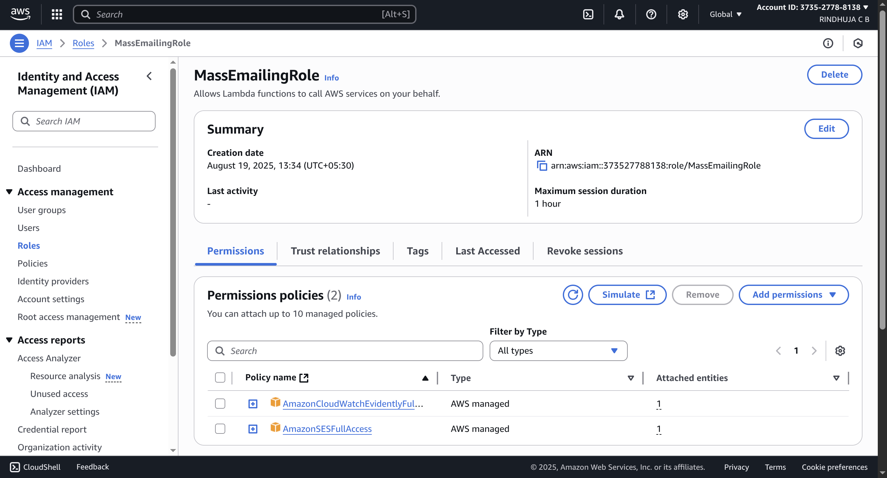
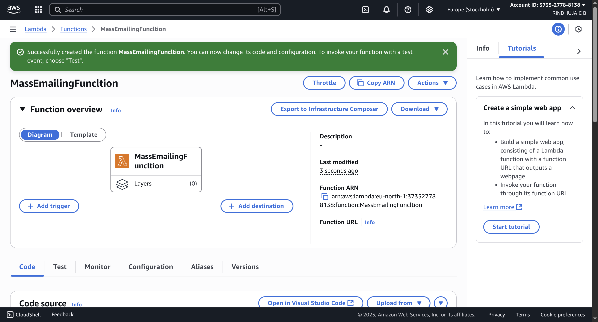
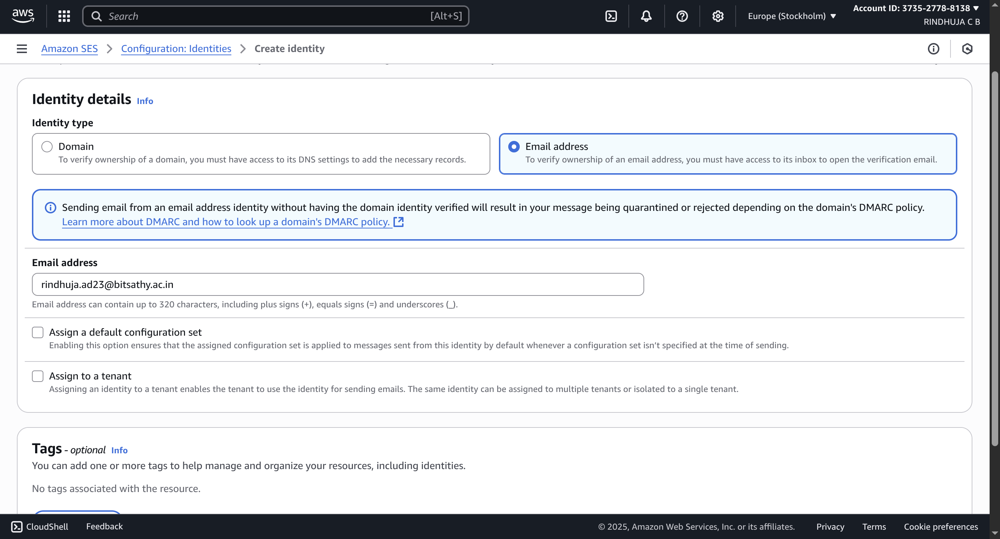
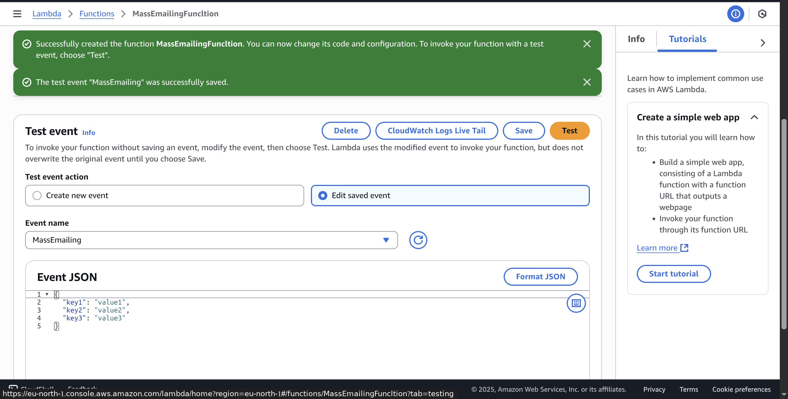
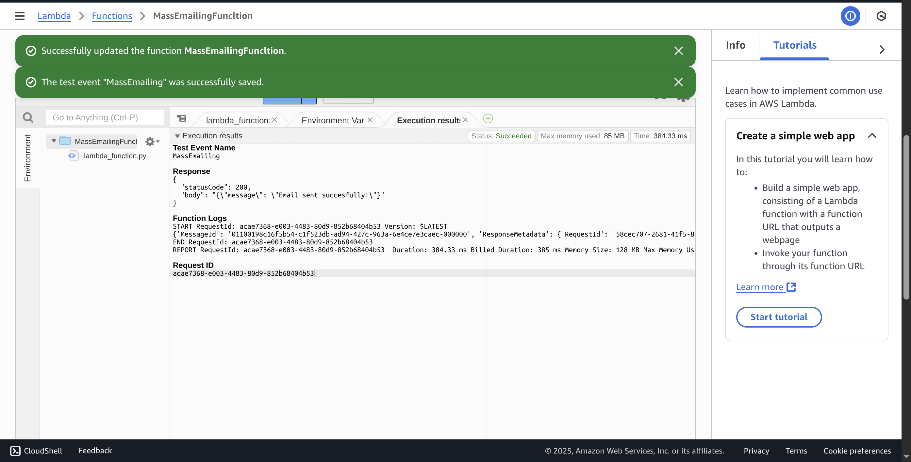
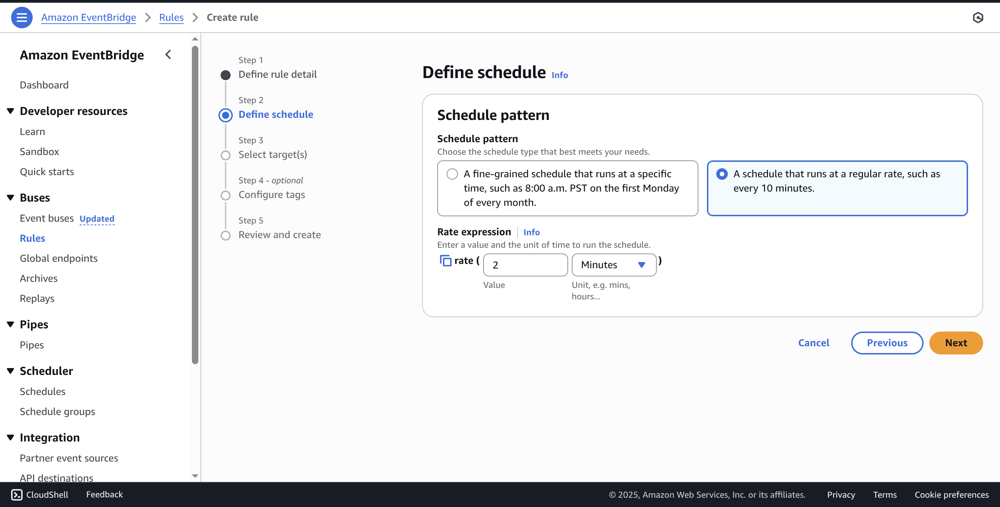
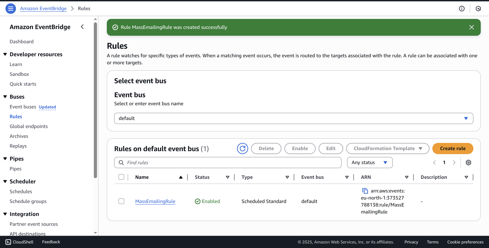
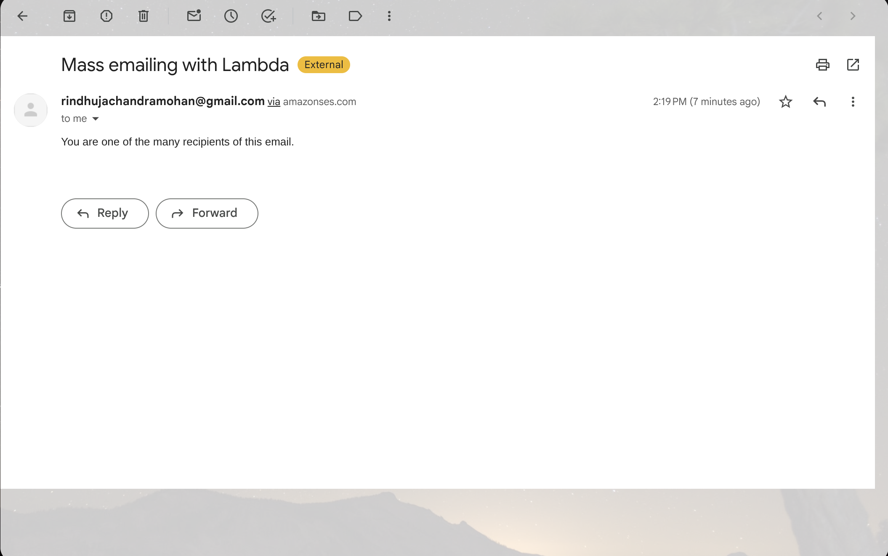

# README.md

# 🚀 Mass Emailing with AWS Lambda

This project shows you how to set up an automated, serverless mass email sender using a few core AWS services. It's a fantastic way to learn about the power of serverless architecture and see how different services can work together seamlessly.

This guide is written for beginners, with a "spoon-fed" approach to ensure you don't miss a single step.

---
## 🛠️ Services Used

* **AWS Lambda**: A serverless compute service that runs your code without you needing to manage servers. We'll use it to run our Python script for sending emails.
* **Amazon Simple Email Service (SES)**: A reliable, scalable, and cost-effective email service that will handle the delivery of our emails.
* **AWS Identity and Access Management (IAM)**: This service helps you securely manage access to your AWS account. We'll create a special "role" that gives our Lambda function the specific permissions it needs.
* **Amazon CloudWatch**: A monitoring and management service. We'll use its "Events" feature to schedule our Lambda function to run automatically on a set timer.

---
## 🏗️ Architecture



---
## ✍️ Step-by-Step Guide

### Step 1: Create an IAM Role

Before we can do anything, we need to create a special set of permissions for our Lambda function. Think of this as giving your function a set of keys so it can safely access other parts of your AWS account.

1.  From the AWS Management Console, search for and open the **IAM** service.
2.  In the left-hand navigation menu, click on **Roles**.
3.  Click the blue **Create role** button.
4.  For **Trusted entity type**, leave it as `AWS service`.
5.  Under **Use case**, find and select **Lambda**. This tells AWS that this role will be used by a Lambda function. Click **Next**.
6.  Now, we'll give our role the necessary permissions. In the search bar, type `SES` and check the box next to `AmazonSESFullAccess`.
7.  In the search bar, type `CloudWatch` and check the box next to `CloudWatchLogsFullAccess`. Click **Next**.
8.  Give your role a descriptive name like `MassEmailingRole`. You can add a description if you like.
9.  Click **Create role**.

**Great!** You've just created a permission set for your future Lambda function.



### Step 2: Create a Lambda Function

Now let's create the place where our code will live.

1.  In the AWS Management Console, search for and open the **Lambda** service.
2.  Click the orange **Create function** button.
3.  Leave **Author from scratch** selected.
4.  Enter a **Function name**, like `MassEmailingFunction`.
5.  Choose your **Runtime**. Select the latest **Python** version available.
6.  Click on the **Change default execution role** dropdown.
7.  Select **Use an existing role**.
8.  From the dropdown, choose the role you just created: `MassEmailingRole`.
9.  Click **Create function**.

**Perfect!** You now have a blank Lambda function ready for your code.



### Step 3: Configure Amazon SES (Simple Email Service)

Amazon SES requires you to "verify" the email addresses you'll be sending from and to. This prevents spam and makes sure you own the emails you're using.
If you have already configured SES prior to this, feel free to skip this step
- In the AWS Management Console, search for and open the **SES** service '-->' SMTP Settings
- Create SMTP Credentials
- Click SMTP Credentials
- Create User (under smtp)
- Retrieve SMTP credentials by downloading a .csv file or by copying the credentials and storing them in a file.
- Click "Return to SES Console".

1.  In the left-hand navigation menu, click on **identities**.
2.  Click the **Create identity** button.
3.  Choose `Email address` as the identity type.
4.  Enter the email address you will be sending emails **from**. This is your `sender_email`.
5.  Click **Create identity**.
6.  **IMPORTANT:** Go to the inbox of the email address you just entered. You will receive a verification email from Amazon. Click the link inside to verify ownership. The status of your identity in the AWS console will change from `Pending` to `Verified`.
7.  Repeat this process for the email address you will be sending emails **to** (your `recipient_email`). You'll need to verify both for this project to work.
   


### Step 4: Add Code and Configure Your Lambda Function

Now it's time to add the Python code that will send the emails.

1.  Navigate back to your `MassEmailingFunction` in the Lambda console.
2.  Scroll down to the **Code source** section.
3.  Replace the default `lambda_function.py` code with the following Python code.
    ```python
    import boto3
    import json
    
    print("Loading Function...")
    
    def lambda_handler(event, context):
        # Initialize the Simple Email Service (SES) client in the specified AWS region
        # Make sure to replace 'eu-north-1' with your region!
        ses = boto3.client("ses", region_name="eu-north-1")
    
        # Define sender and recipient email addresses
        # CHANGE THESE to the emails you verified in Step 3!
        sender_email = 'abc@gmail.com'
        recipient_email = 'def@gmail.com'
    
        # Compose email subject and message
        subject = "Mass emailing with Lambda"
        message = "You are one of the many recipients of this email."
    
        # Send email with SES
        response = ses.send_email(
            Source=sender_email,
            Destination={'ToAddresses': [recipient_email]},
            Message={'Subject': {'Data': subject}, 'Body': {'Text': {'Data': message}}}
        )
        print(response)
    
        return {
            'statusCode': 200,
            'body': json.dumps({'message': 'Email sent successfully!'})
        }
    ```
4.  **Important:** Remember to change the **`sender_email`** and **`recipient_email`** to the verified addresses you set up in the previous step.
5.  Click the orange **Deploy** button to save your changes.

#### Test Your Function

Let's make sure it works before we automate it.

1.  Click the **Test** tab next to the **Code** tab.
2.  In the dropdown, select **Configure test event**.
3.  Give the event a name, like `MyMassEmailingTest`.
4.  Leave the default JSON as is. Click **Save**.
5.  Now, click the big orange **Test** button.

If everything is configured correctly, you should see `Execution result: succeeded` and a status code of `200`. Go check the inbox of your `recipient_email`! You should see an email.





### Step 5: Schedule with CloudWatch

Now for the magic! We'll use CloudWatch to automatically trigger our Lambda function on a schedule.

1.  In the AWS Management Console, search for and open **CloudWatch**.
2.  In the left-hand navigation, under the **Events** section, click on **Rules**.
3.  Click the **Create rule** button.
4.  Enter a **Name** for your rule, such as `MassEmailingRule`.
5.  Under **Event Source**, choose `Schedule`.
6.  You have two options: a fixed rate or a more flexible Cron expression. Let's use a fixed rate for this example. Choose **A schedule that runs at a regular rate, such as every 10 minutes.**
7.  Enter `2` and select `minutes` from the dropdown. This will trigger our function every two minutes.
8.  Click **Next**.
9.  Under **Select targets**, choose **Lambda function**.
10. In the **Function** dropdown, find and select your `MassEmailingFunction`.
11. Click on **Skip to review and create**.
12. Review your rule and click **Create rule**.





---
## 🎉 Check Your Mail!

Congratulations! Your automated email system is now live.

You should receive an email in your recipient's inbox every two minutes. If you don't, go back and double-check each step. The CloudWatch rule and the Lambda logs are your best friends for troubleshooting.


